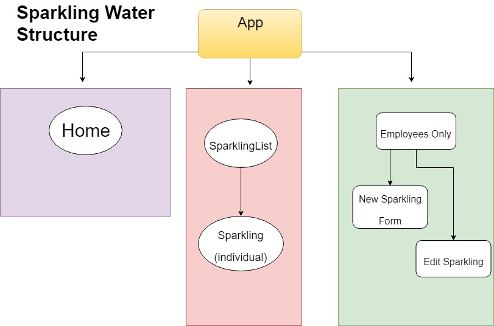

# Sparkling Water Hipster Bar

#### By Liz Kelley

## Description
This application will display lists of sparkling water, with options to add and edit sparkling waters.

## Specifications

## Setup/Installation

* Clone repository
* In the project directory, you can run:
#### `npm start`
  Runs the app in the development mode. 

* Open [http://localhost:3000](http://localhost:3000) to view it in the browser.
  The page will reload if you make edits. 
  You will also see any lint errors in the console.

## Technologies used
* React
* Javascript
* Node.js
* Bootstrap
* HTML
* CSS

#### License
*This software is licensed under the MIT license.*

Copyright (c) 2019 **Liz Kelley**

This project was bootstrapped with [Create React App](https://github.com/facebook/create-react-app).